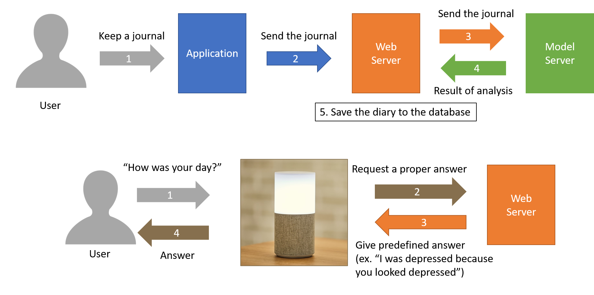

# NUGUMATE: NUGU speaker empathizes with your feelings 

 Both demands for AI speaker and people who regard AI speakers as an interlocutor are increasing. For these reasons, the demand for the service that AI speakers can provide comfort is increasing.
 
A user is assigned a ‘keyword(nuguname)’ from the server, for example ‘navi’ and it is displayed in the main screen of the application. The user keeps a diary in the application, sends it to the server(web server), and the server sends the diary to the sentiment analysis model linked with another server(the model server) to classify the emotions of the diary into positive or negative. Then the model server gets the result from the model and sends it to the web server so that the web server can save user information, the contents of the diary and the result of sentiment analysis model to the database. 

After that, when the user starts a daily conversation with the NUGU device using ‘nuguname’ such as "How was your day, navi?", then it requests a proper answer to the server and the server gives the answer to the speaker based on the result of the model that is saved in the database, such as “I was depressed because you looked depressed”, and the speaker answers it to the user. 

## Brief Introduction of this project's interaction
  

## You can also see...
  - Our latest description of this project : https://www.overleaf.com/read/mgsvwfwgvqjb
  - Server used in this project : https://github.com/flyc4/NUGUMATE-Server  
  - Model used in this project : https://github.com/hyun1014/NUGUMATE_Model  
  - Korean Version of this README : https://github.com/cngjsskaisme/NUGUMate/blob/master/README_ko.md
  - Korean blog post about this project : https://TnTaekjoon.github.io/NUGUMate/
