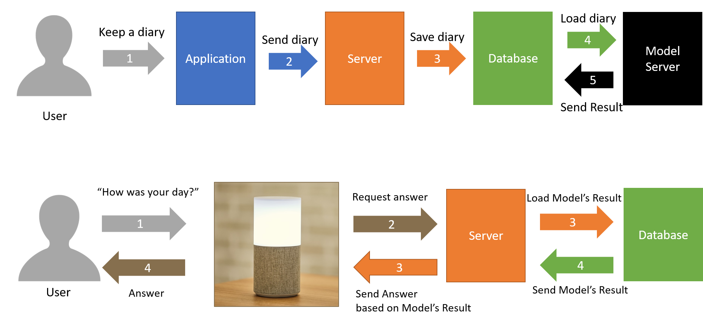

# NUGUMATE: NUGU speaker empathizes with your feelings 

 Both demands for AI speaker and people who regard AI speakers as an interlocutor are increasing. For these reasons, the demand for the service that AI speakers can provide comfort is increasing. 

 A user keeps a note in the application, sends it to the server, and the server saves the contents of the note, date that the user chose and the user information to the database. Then, the sentiment analysis model linked with another server(the model server) loads the note to classify the emotions of each sentence of the note into positive or negative and append the result to the database where the note stored.

 After that, when the user starts a daily conversation with the NUGU device, such as "Aria, how was your day?", then it requests a proper answer to the server and the server gives the answer to the speaker based on the result of the model that is saved in the database, such as “I was depressed because you looked depressed”, and the speaker answers it to the user.

## Brief Introduction of this project's interaction
  

## You can also see...
  - Our latest description of this project : https://www.overleaf.com/read/mgsvwfwgvqjb
  - Server used in this project : https://github.com/flyc4/NUGUMATE-Server  
  - Model used in this project : https://github.com/hyun1014/NUGUMATE_Model  
  - Korean Version of this README : https://github.com/cngjsskaisme/NUGUMate/blob/master/README_ko.md
